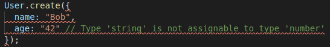
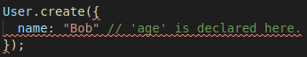
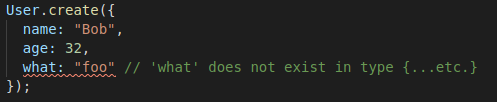
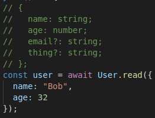

# ★★★ Tynogels

[](https://travis-ci.org/poteat/tynogels)
[](https://codecov.io/gh/poteat/tynogels)
[](https://snyk.io/test/github/poteat/tynogels)
[](https://david-dm.org/poteat/tynogels)
[](https://david-dm.org/poteat/tynogels?type=dev)

A modern, await-based DynamoDB data mapper built on runtime types.

## Features

- Promise-first design using ES6+ async/await.
- Advanced, context-driven types.
- Chained query operations.
- Inspired by Dynogels.

## Installation

```sh
npm i tynogels
```

## Usage

### Access Keys

AWS access keys should be defined in `~/.aws/credentials". If running on Lambda, AWS access will be automatically granted.

Regions and endpoints are defined via the config option:

```ts
import tynogels from "tynogels";

tynogels.config({
  endpoint: "localhost",
  region: "us-east-1"
});
```

### Defining Models

A model represents a data record type that can be stored and retrieved from DynamoDB. These models are defined via the "define" function.

All key definitions are defined using run-time types from io-ts.

```ts
import tynogels from "tynogels";
import t from "io-ts";

tynogels.config({
  region: "us-east-1",
});

const User = tynogels.define({
  tableName: "users"
  hashKey: {
    name: t.string
  },
  sortKey: {
    age: t.number
  },
  schema: {
    email: t.string,
    thing: t.string
  }
});
```

### Advanced Type-Checking

Tynogels will automatically check that required properties are present in all API commands, and that they are of the correct type. Given the above definition of 'User', a correct record creation call would be:

```ts
User.create({
  name: "Bob",
  age: 32
});
```

However, if we try to pass in age as a string, we get a compile-time error:



Additionally, if we do not supply an age, the compiler will complain:



We can supply additional attributes as long as they are defined in the schema:

```ts
User.create({
  name: "Bob",
  age: 32,
  email: "bob@foo.net"
});
```

But if we try to add an attribute that isn't defined in the schema, the compiler will complain:



All API calls supported by Tynogels are type-checked in the above style, and calls which return data records return the underlying type annotation.

## Reading Entries

Reading entries is done by the "read" command, which takes in an object defined by your hash key and/or sort key, depending on your schema. It returns an object of the underlying native type.



Care must be taken: the type annotation will be deceitful in the case that the underlying object that is attempting to be read does not exist.

## Further Commands Supported

Tynogels is a hard subset of Dynogels, and doesn't implement all the functionality that the NodeJS DynamoDB API supports. It does implement the following however:

- Updating records a la `User.update({...})`
- Deleting records a la `User.delete({...})`
- Efficient batch creation via `User.create({...}[])`
- Batch reading via `User.batchRead({...}[])`
- Simple, typed, chained query commands:
  - `User.query("Bob").exec()`
  - `User.query("Bob").where("age").between(20, 35).exec()`
  - `User.query("Bob").where("age").gte(20).exec()`

Pull requests welcome :)

## Maintainers

- [Michael Poteat](https://github.com/poteat) \<me@mpote.at\>
- ... you?
